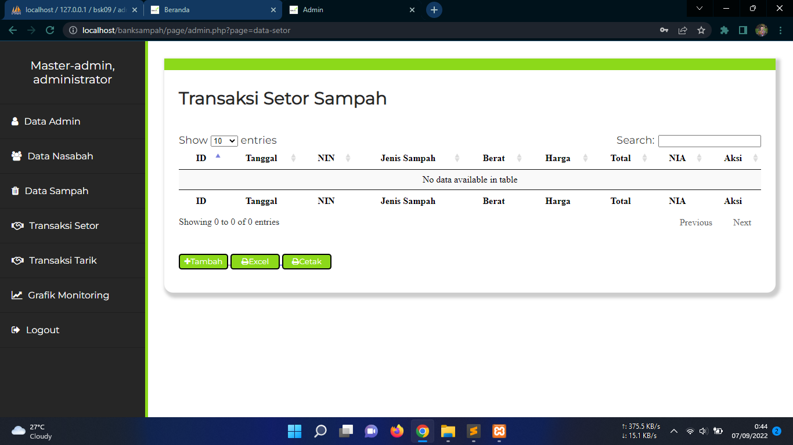
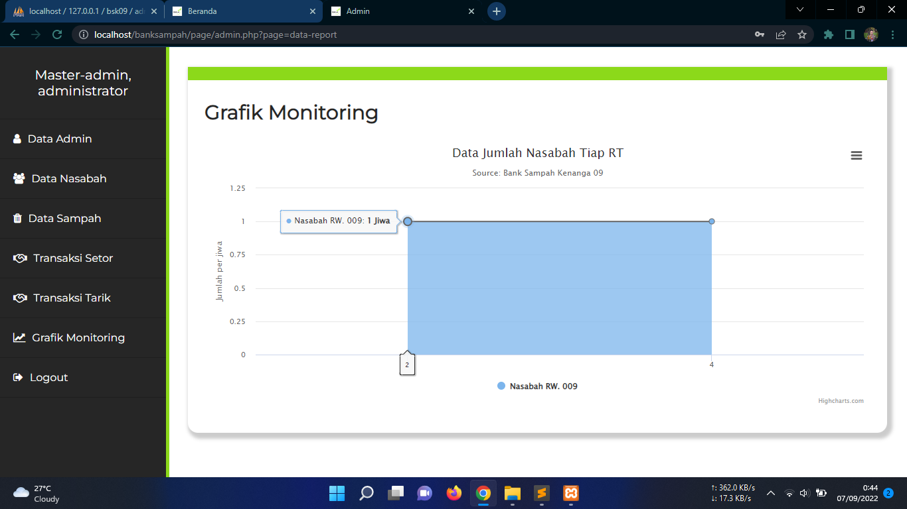

# Aplikasi Bank Sampah
Sistem informasi bank sampah berbasis web ini memiliki tampilan yang sederhana dan fitur yang menarik.

To access admin page, add url /admin. Example http://localhost/banksampah/page/login.php

## Tampilan Aplikasi

## Admin Account
|   Level   | Username  | Password   |
|:---------:|:---------:|-----------:|
| Master Admin     | admin123  | admin123   
| Admin            | ADM241000     | admin123
dinas lingkungan hidup   ADM241100     admin123

## Sistem Requirement
- Database MySQL
- XAMPP / PHP 5.6

Perbedaan antara rekapitulasi-sampah.php dan status-distribusi-sampah.php umumnya terletak pada fungsi dan tujuan masing-masing halaman dalam sistem manajemen sampah. Meskipun keduanya berhubungan dengan distribusi atau pengelolaan sampah, fungsinya cenderung berbeda.

1. rekapitulasi-sampah.php
Tujuan: Halaman ini lebih fokus pada rekapitulasi atau laporan statistik mengenai jumlah sampah yang dikelola oleh bank sampah. Biasanya, halaman ini digunakan untuk menyajikan data akumulasi atau total dari sampah yang telah didistribusikan atau diproses dalam periode tertentu.
Fungsi:
Menampilkan jumlah total sampah yang terkumpul atau didistribusikan.
Menyajikan statistik atau grafik yang menggambarkan distribusi sampah berdasarkan kategori seperti jenis sampah (organik, non-organik), volume atau berat sampah, dan periode tertentu.
Dapat digunakan untuk laporan keuangan atau evaluasi kinerja bank sampah dalam mengelola sampah.
Biasanya mengandung data agregat atau total dari berbagai transaksi distribusi sampah dalam periode waktu tertentu.
2. status-distribusi-sampah.php
Tujuan: Halaman ini berfokus pada status distribusi sampah yang lebih detail, termasuk informasi mengenai proses pengiriman sampah ke tempat tujuan (misalnya, pengumpulan atau pembuangan sampah). Halaman ini juga mengelola dan menampilkan status terkini dari distribusi sampah.
Fungsi:
Menampilkan detail tentang distribusi sampah individual, seperti nama nasabah, alamat, jenis sampah, berat sampah, dan status distribusi (apakah sudah dikirim, belum dikirim, atau selesai).
Menyediakan opsi untuk memperbarui status distribusi, seperti mengubah status sampah menjadi "Sudah Dikirim" atau "Closed".
Dapat digunakan untuk memantau status distribusi sampah dalam proses, memberi informasi kepada petugas atau admin apakah distribusi sudah dilakukan sesuai rencana.
Memungkinkan admin untuk memverifikasi dan mengelola status pengiriman sampah, serta melihat data distribusi dalam periode tertentu.
Perbedaan Utama:
rekapitulasi-sampah.php lebih berfokus pada laporan agregat (total dan statistik) mengenai sampah yang telah terkumpul atau didistribusikan.
status-distribusi-sampah.php lebih berfokus pada pengelolaan status distribusi sampah secara lebih detail dan operasional, memberikan informasi mengenai proses distribusi dan memungkinkan pembaruan status distribusi.
Kesimpulan:
rekapitulasi-sampah.php: Untuk laporan atau statistik terkait pengumpulan dan distribusi sampah secara umum.
status-distribusi-sampah.php: Untuk mengelola dan memantau status distribusi sampah secara spesifik, baik per transaksi maupun keseluruhan distribusi dalam periode tertentu.
Jadi, kedua halaman tersebut memiliki fungsi yang berbeda, meskipun keduanya berkaitan dengan pengelolaan sampah.